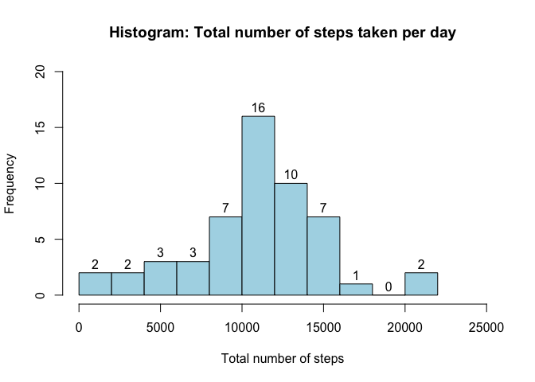
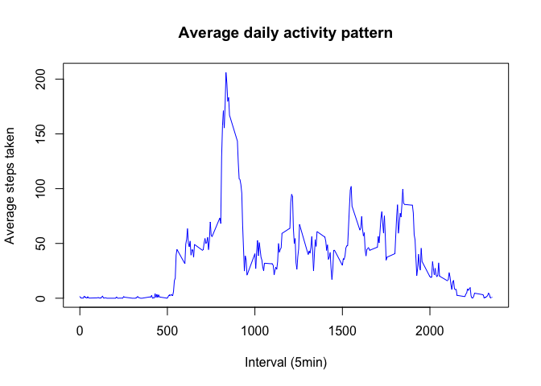
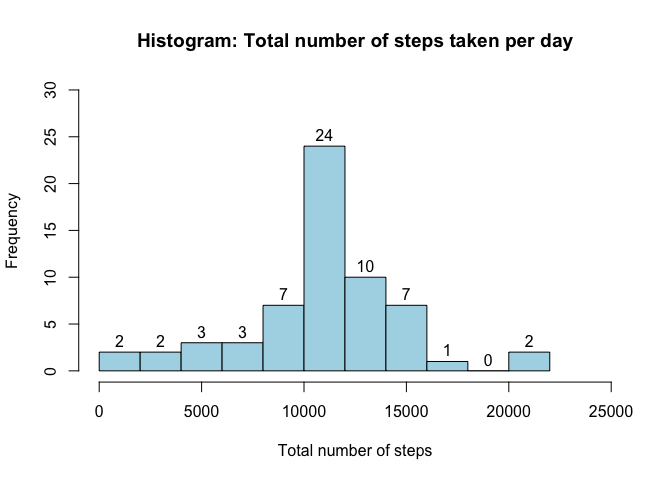

# Reproducible Research: Peer Assessment 1


##Introduction
It is now possible to collect a large amount of data about personal movement using activity monitoring devices such as a Fitbit, Nike Fuelband, or Jawbone Up. These type of devices are part of the “quantified self” movement – a group of enthusiasts who take measurements about themselves regularly to improve their health, to find patterns in their behavior, or because they are tech geeks. But these data remain under-utilized both because the raw data are hard to obtain and there is a lack of statistical methods and software for processing and interpreting the data.

This assignment makes use of data from a personal activity monitoring device. This device collects data at 5 minute intervals through out the day. The data consists of two months of data from an anonymous individual collected during the months of October and November, 2012 and include the number of steps taken in 5 minute intervals each day.

##Data
The data for this assignment has been included in this repository:

Dataset: Activity monitoring data [52K]

The variables included in this dataset are:

steps: Number of steps taking in a 5-minute interval (missing values are coded as NA)

date: The date on which the measurement was taken in YYYY-MM-DD format

interval: Identifier for the 5-minute interval in which measurement was taken

The dataset is stored in a comma-separated-value (CSV) file and there are a total of 17,568 observations in this dataset.

##Assignment
This report answers the questions detailed below in a single R markdown document that was processed by knitr and transformed into an HTML file.

Throughout the report all the code that were used to generate the output presented, are included and shown.

##Locading and processing the data

```r
# load the data from zip file if the csv file does not exists
if(!file.exists('activity.csv')) {
        unzip('activity.zip')
}

allData <- read.csv("activity.csv", stringsAsFactors = FALSE)
summary(allData); str(allData)
```

```
##      steps            date              interval     
##  Min.   :  0.00   Length:17568       Min.   :   0.0  
##  1st Qu.:  0.00   Class :character   1st Qu.: 588.8  
##  Median :  0.00   Mode  :character   Median :1177.5  
##  Mean   : 37.38                      Mean   :1177.5  
##  3rd Qu.: 12.00                      3rd Qu.:1766.2  
##  Max.   :806.00                      Max.   :2355.0  
##  NA's   :2304
```

```
## 'data.frame':	17568 obs. of  3 variables:
##  $ steps   : int  NA NA NA NA NA NA NA NA NA NA ...
##  $ date    : chr  "2012-10-01" "2012-10-01" "2012-10-01" "2012-10-01" ...
##  $ interval: int  0 5 10 15 20 25 30 35 40 45 ...
```

###Converting the data to use further

```r
# make the date actual dates
allData$date <- as.POSIXct(allData$date, format = "%Y-%m-%d")
str(allData$date)
```

```
##  POSIXct[1:17568], format: "2012-10-01" "2012-10-01" "2012-10-01" "2012-10-01" ...
```

#What is the mean total number of steps taken per day
(Ignore / Omit the missing values for this part)

1. Calculate the total number of steps taken per day.

```r
totalStepsPerDay <- aggregate(steps~date, data=na.omit(allData), FUN = sum)
```

2. Histogram of the Toatal Number of Steps Per Day

```r
totalStepsPerDay <- aggregate(steps~date, data=na.omit(allData), FUN = sum)
hist(totalStepsPerDay$steps, main = "Histogram: Total number of steps taken per day", xlab = "Total number of steps", col = "lightblue", breaks = 8, labels = TRUE, ylim = c(0,20), xlim = c(0,25000))
```

 

3. Calculate the mean and median of total number of steps taken per day

```r
#mean of total num of steps
mean(totalStepsPerDay$steps)
```

```
## [1] 10766.19
```

```r
#median of total number of steps
median(totalStepsPerDay$steps)
```

```
## [1] 10765
```

#What is the daily activity pattern?

1. Make a time series plot (i.e. type = "l") of the 5-minute interval (x-axis) and the average number of steps taken, averaged across all days (y-axis)

```r
#average number of steps taken across all days - so ignore date column
avgSteps <- aggregate(steps ~ interval, data=allData, mean)
plot(avgSteps$interval, avgSteps$steps, type="l", main = "Average daily activity pattern",
     xlab = "Interval (5min)", ylab = "Average steps taken", col="blue")
```

 

2. Which 5-minute interval, on average across all the days in the dataset, contains the maximum number of steps?

```r
#get the max steps and extract the time interval for this value
mx <- max(avgSteps$steps)
avgSteps$interval[avgSteps$steps == mx]
```

```
## [1] 835
```

#Input missing values
Note that there are a number of days/intervals where there are missing values (coded as NA). The presence of missing days may introduce bias into some calculations or summaries of the data.

1. Calculate and report the total number of missing values in the dataset (i.e. the total number of rows with NAs)

```r
# number of missing values in the dataset
# msValues <- is.na(allData)
length(allData[is.na(allData)])
```

```
## [1] 2304
```
2. Devise a strategy for filling in all of the missing values in the dataset. The strategy does not need to be sophisticated. For example, you could use the mean/median for that day, or the mean for that 5-minute interval, etc.

```r
# get index of na values
naIndex <- which(is.na(allData))
# substitute the missing values with the average of the day
newMeans <- rep(mean(allData$steps, na.rm=TRUE), inter=length(naIndex))
```

3. Create a new dataset that is equal to the original dataset but with the missing data filled in.


```r
allData[naIndex, "steps"] <- newMeans
# see if the NA's are replaced correctly
summary(allData)
```

```
##      steps             date                        interval     
##  Min.   :  0.00   Min.   :2012-10-01 00:00:00   Min.   :   0.0  
##  1st Qu.:  0.00   1st Qu.:2012-10-16 00:00:00   1st Qu.: 588.8  
##  Median :  0.00   Median :2012-10-31 00:00:00   Median :1177.5  
##  Mean   : 37.38   Mean   :2012-10-31 00:06:53   Mean   :1177.5  
##  3rd Qu.: 37.38   3rd Qu.:2012-11-15 00:00:00   3rd Qu.:1766.2  
##  Max.   :806.00   Max.   :2012-11-30 00:00:00   Max.   :2355.0
```

4. Make a histogram of the total number of steps taken each day and Calculate and report the mean and median total number of steps taken per day. 


```r
#Calculate the total number of steps taken per day again
totalStepsPerDay <- aggregate(steps~date, data=allData, FUN = sum)
hist(totalStepsPerDay$steps, main = "Histogram: Total number of steps taken per day", xlab = "Total number of steps", col = "lightblue", breaks = 8, labels = TRUE, ylim = c(0,30), xlim = c(0,25000))
```

 

```r
#mean of total num of steps
mean(totalStepsPerDay$steps)
```

```
## [1] 10766.19
```

```r
#median of total number of steps
median(totalStepsPerDay$steps)
```

```
## [1] 10766.19
```

4.1. Do these values differ from the estimates from the first part of the assignment? 
Did not change much as I used the median values to fill the NA values

4.2. What is the impact of imputing missing data on the estimates of the total daily number of steps?

From this histogram you can see the total number of steps has increased after the values were take in account.

##Are there differences in activity patterns between weekdays and weekends?

For this part the weekdays() function may be of some help here. Use the dataset with the filled-in missing values for this part.

1. Create a new factor variable in the dataset with two levels – “weekday” and “weekend” indicating whether a given date is a weekday or weekend day.


2. Make a panel plot containing a time series plot (i.e. type = "l") of the 5-minute interval (x-axis) and the average number of steps taken, averaged across all weekday days or weekend days (y-axis). See the README file in the GitHub repository to see an example of what this plot should look like using simulated data.

